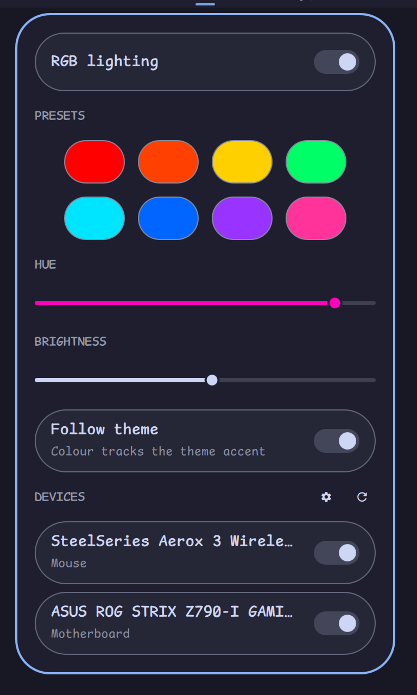

# RGB Lighting — Omarchy shell plugin

Control your RGB lighting from the Omarchy bar: a widget icon tinted with
the current colour, and a popout with on/off, preset swatches, a hue slider,
a brightness slider, and a follow-theme toggle that keeps your lighting matched
to your Omarchy theme accent.



Works with any RGB controller [OpenRGB](https://openrgb.org) supports —
motherboard ARGB headers, case controllers, and the rest.

## How it works

```
keybindings ──┐
menu entries ─┼──▶ omarchy-rgb (bundled CLI) ──▶ OpenRGB SDK server (systemd --user)
theme hook ───┘         │ writes
                        ▼
        ~/.local/state/omarchy-rgb/state.json
                        │ watched
                        ▼
              bar widget (this plugin)
```

One state file is the single source of truth. The widget, keybindings and
menu all act through the same CLI, so they can never disagree — and your
lighting is restored on every boot by the systemd unit.

## Install

```bash
omarchy plugin add https://github.com/didlix/omarchy-openrgb.git --enable
~/.config/omarchy/plugins/didlix.case-rgb/bin/omarchy-rgb setup
```

`setup` is interactive and idempotent. It:

1. offers to install the `openrgb` package (via `omarchy pkg add`) if missing;
2. creates a private venv and installs
   [openrgb-python](https://github.com/jath03/openrgb-python) into it
   (GPL-3.0, fetched from PyPI at setup time — not distributed with this
   MIT-licensed plugin);
3. writes and enables the `openrgb-server` systemd **user** unit (SDK server
   on 127.0.0.1, restores your lighting state after every start);
4. symlinks `~/.local/bin/omarchy-rgb` so keybindings and menu entries can
   call it by name;
5. with `--with-theme-hook`, installs a theme-set hook so the case follows
   your theme accent.

## Usage

- **Left-click** the bar icon: open the control popout.
- **Right-click**: toggle lighting on/off.
- The **DEVICES** section at the bottom of the popout lists every controller
  OpenRGB can see — toggle which ones the plugin manages, including none at
  all (`omarchy-rgb set-device --none` from the CLI).
- CLI: `omarchy-rgb status | jq .` — plus `on`, `off`, `toggle`,
  `set-color '#RRGGBB'`, `set-hue 0-359`, `brightness 0-100|+N|-N`,
  `cycle-preset`, `follow-theme on|off|toggle`, `theme-color`.

Presets are user-editable: edit the `presets` array in
`~/.local/state/omarchy-rgb/state.json`.

### Which devices does it control?

Auto-detected: the first OpenRGB device of type *motherboard*, falling back
to device 0. To control a different device — or several at once (case +
mouse, say) — use the DEVICES toggles in the popout, or pin them by name
substring from the CLI (check `openrgb --list-devices`):

```bash
omarchy-rgb set-device "ASUS ROG STRIX" "Aerox"
omarchy-rgb set-device        # no names: back to auto
```

Every listed device gets the same colour, all zones alike. Brightness is
implemented by scaling the RGB value in software, so it works on controllers
with no native brightness. "Off" uses the device's native Off mode when it
has one, and black otherwise.

Per-device quirks are handled: devices without a Static mode (many mice)
fall back to Direct, which holds for as long as the SDK server runs — that
is what the systemd unit is for. A device that fails to apply (a sleeping
wireless mouse, say) is skipped with a warning rather than blocking the
rest. Note that lighting a wireless mouse costs battery.

### Per-theme colours

With follow-theme on, the lighting colour is resolved per theme, first match
wins:

1. **Your override** — `~/.config/omarchy-rgb/themes.toml`, easiest set via
   the CLI:

   ```bash
   omarchy-rgb theme-color '#d7827e'            # for the current theme
   omarchy-rgb theme-color rose-pine '#d7827e'  # for any theme by slug
   omarchy-rgb theme-color rose-pine --unset
   omarchy-rgb theme-color                      # list overrides
   ```

2. **The theme's own `[rgb]` table** — theme authors (or a
   [theme overlay](https://learn.omacom.io/) in
   `~/.config/omarchy/themes/<slug>/`) can declare the colour the theme wants
   RGB hardware lit with, right in `colors.toml`:

   ```toml
   [rgb]
   primary = "#d7827e"
   ```

   Unknown tables are ignored by every other Omarchy component, so this is
   safe to add to any theme.

3. **Curated defaults** — a small built-in table for stock themes whose
   accent is not the colour the theme is known by (Rose Pine's accent is the
   pine teal, not the rose). PRs welcome.

4. **The theme accent** — the fallback that always exists.

A change made with `theme-color` relights the case immediately when it
affects the active theme.

### Device roles

With several managed devices, each can follow a different slot of the theme
while follow-theme is on: **primary** (the default — the resolved colour
above), **secondary** (the `secondary` key in your themes.toml or a theme's
`[rgb]` table, falling back to primary), or **accent** (the raw theme
accent). A manually picked colour still applies to every device alike.

Assign roles from the popout — managed device rows grow a role chip while
follow-theme is on; click it to cycle — or from the CLI (devices matched
like `set-device`, by case-insensitive substring):

```bash
omarchy-rgb device-role "Aerox" secondary
omarchy-rgb device-role                          # list assignments
omarchy-rgb theme-color rose-pine '#56949F' --secondary
```

### Persisting colour to stubborn firmware

Where supported, discrete actions also save the mode to the device's onboard
memory (OpenRGB SaveMode); slider drags skip the save to spare the flash.
Some firmware ignores SaveMode — SteelSeries mice, for instance, only
persist through their own tool. For those, add `persist_commands` to
`~/.local/state/omarchy-rgb/state.json`: a list of argv templates run after
each save-worthy change, with `{color}` replaced by the brightness-scaled
hex (`#000000` when off). Example for a SteelSeries Aerox via
[rivalcfg](https://github.com/flozz/rivalcfg):

```json
"persist_commands": [
  ["rivalcfg", "--z1", "{color}", "--z2", "{color}", "--z3", "{color}"]
]
```

SteelSeries tip: the white flash on click is the mouse's own *reactive
illumination*, not OpenRGB — turn it off once with
`rivalcfg --reactive-color off`.

### Vendor notes

Per-vendor setup and troubleshooting notes live in [`docs/vendors/`](docs/vendors/):

- [SteelSeries](docs/vendors/steelseries.md) — colour persistence across
  sleep, reactive illumination
- [Corsair](docs/vendors/corsair.md) — udev permissions, unregistered
  product IDs
- [ASUS Aura](docs/vendors/asus-aura.md) — zones and device grouping,
  SMBus modules

### Keybindings

Add to `~/.config/hypr/bindings.lua` (adjust combos to taste — the CTRL+R
family is taken by Omarchy's reminders):

```lua
o.bind("SUPER + SHIFT + R", "RGB lighting panel", "omarchy-shell didlix.case-rgb toggle")
o.bind("SUPER + ALT + R", "RGB on/off", "omarchy-rgb toggle")
o.bind("SUPER + CTRL + BRACKETRIGHT", "RGB brighter", "omarchy-rgb brightness +10")
o.bind("SUPER + CTRL + BRACKETLEFT", "RGB dimmer", "omarchy-rgb brightness -10")
o.bind("SUPER + SHIFT + ALT + R", "RGB next preset", "omarchy-rgb cycle-preset")
```

### Menu entries

Add to `~/.config/omarchy/extensions/omarchy-menu.jsonc`:

```jsonc
"style.rgb":          {"icon":"󰌵","label":"RGB Lighting","aliases":["rgb","lighting"]},
"style.rgb.toggle":   {"icon":"󰔡","label":"Lighting","checked":"omarchy-rgb is-on","action":"omarchy-rgb toggle"},
"style.rgb.panel":    {"icon":"","label":"Open Panel","action":"omarchy-shell didlix.case-rgb open"},
"style.rgb.preset":   {"icon":"󰈊","label":"Next Preset","action":"omarchy-rgb cycle-preset"},
"style.rgb.brighter": {"icon":"󰃠","label":"Brighter","action":"omarchy-rgb brightness +10"},
"style.rgb.dimmer":   {"icon":"󰃞","label":"Dimmer","action":"omarchy-rgb brightness -10"},
"style.rgb.follow":   {"icon":"","label":"Follow Theme","checked":"omarchy-rgb status | jq -e .follow_theme","action":"omarchy-rgb follow-theme toggle"}
```

## Troubleshooting

- **Popout says it can't reach OpenRGB** — run `setup` again; it re-checks
  every step. Then `systemctl --user status openrgb-server`.
- **Wrong device lights up** — `omarchy-rgb set-device <name-substring>`.
- **Some devices missing** — SMBus-attached RGB (DRAM, some boards) needs the
  `i2c-dev` kernel module; see the OpenRGB docs. USB controllers need
  OpenRGB's udev rules (shipped with the Arch package).
- **State vs reality drift** — `omarchy-rgb restore` re-applies the state
  file to the hardware.

## Uninstall

```bash
systemctl --user disable --now openrgb-server
rm -f ~/.config/systemd/user/openrgb-server.service ~/.local/bin/omarchy-rgb \
      ~/.config/omarchy/hooks/theme-set.d/20-case-rgb
rm -rf ~/.local/share/omarchy-openrgb ~/.local/state/omarchy-rgb
omarchy plugin remove didlix.case-rgb
```

## Licence

MIT. `openrgb-python` (GPL-3.0) is installed from PyPI onto your machine at
setup time and is not part of this distribution.
